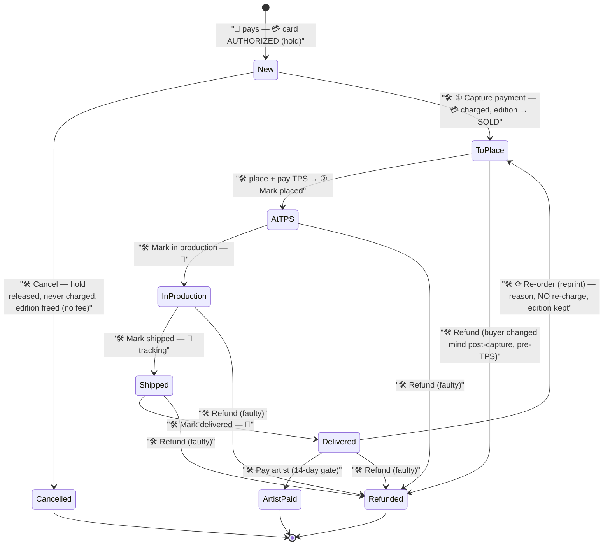
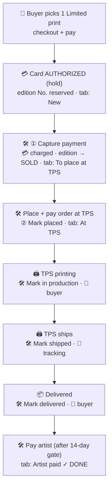
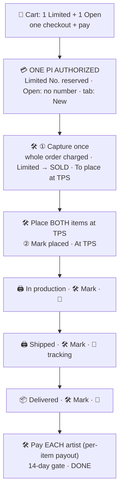
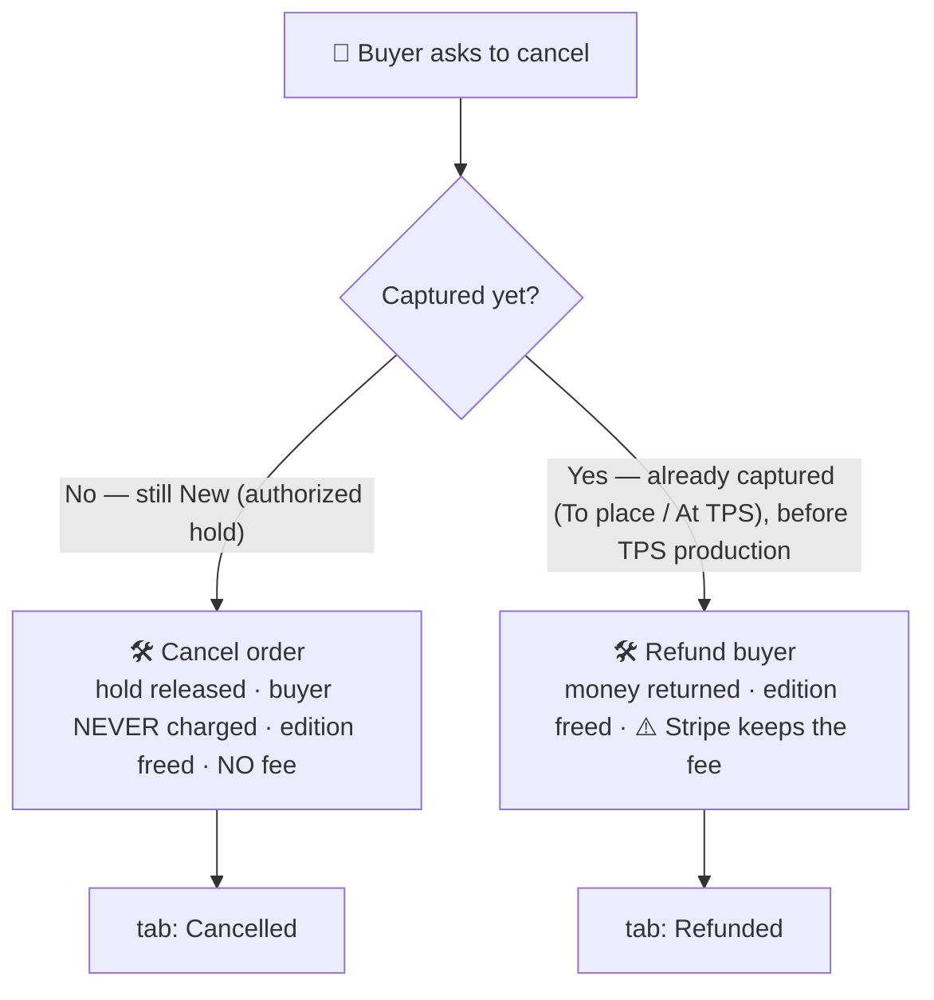
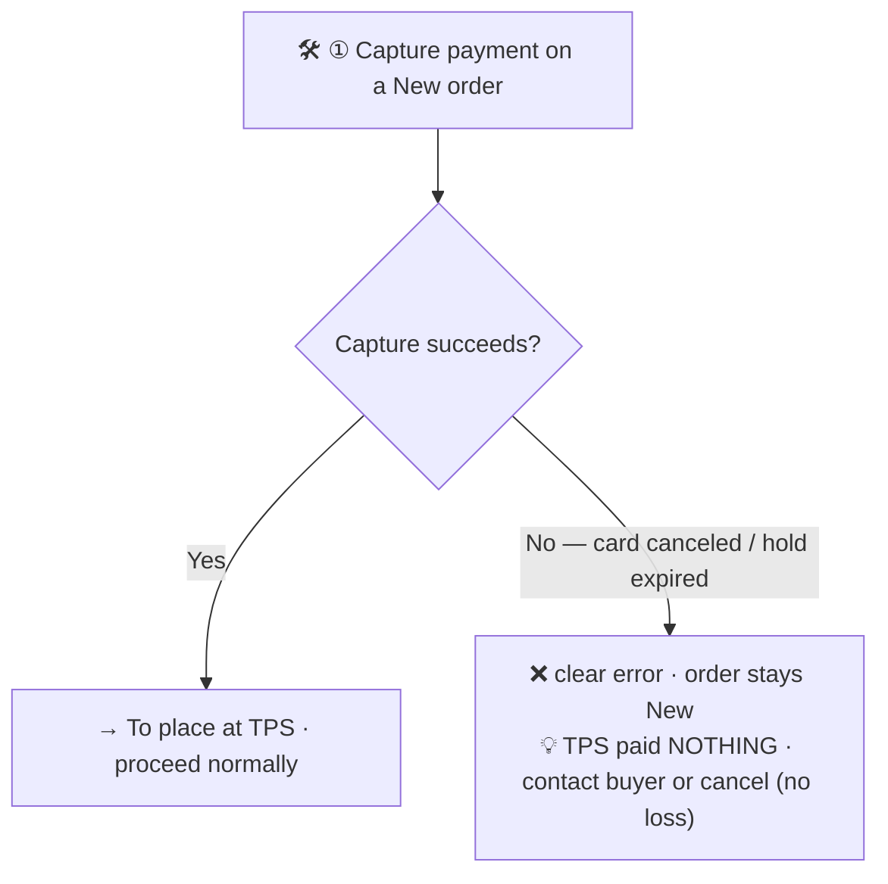
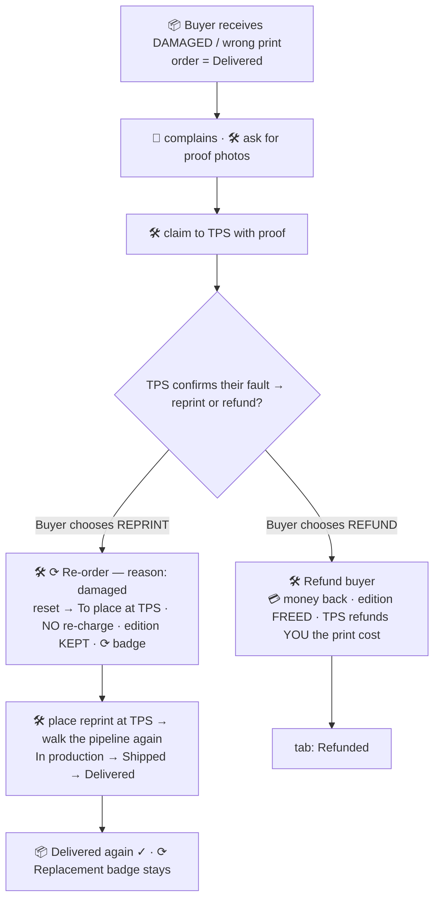

# Order lifecycle — buyer journeys (visual reference)

> Open this in **VS Code → Markdown preview** (or GitHub) to see the diagrams rendered.
> Living reference for the print order flow. Reflects the capture/place split + re-order
> design (specs `2026-06-24-capture-place-split-design.md`,
> `2026-06-26-reorder-reprint-design.md`) and the money rules in
> `memory/project_capture_tps_money_flow.md`.

## Legend

| Icon | Meaning |
|---|---|
| 👤 | Buyer action |
| 🛠 | Admin action (you, in /admin/orders) |
| 🖨 | The Print Space (TPS) |
| 💳 | Money event |
| 📧 | Buyer email sent |
| 📦 | Delivery |
| ⟳ | Reprint / replacement |

**Money rules (the spine of everything):**
- **Authorize** (at checkout) = a *hold*, no money taken yet.
- **Capture** (admin, step ①) = card actually *charged*; the limited edition number flips to **SOLD**.
- **Cancel before capture** = hold released, buyer *never charged*, **no fee**, edition number freed.
- **Refund after capture** = money returned, edition number freed — but **Stripe keeps its fee**.
- **Re-order (reprint)** = **no new charge**, edition number **kept** (same numbered copy remade).
- **Pay TPS only AFTER a successful capture** (TPS charges immediately; capture-first protects your cash).

---

## Master state machine

Every journey below is a path through this.

---

## Case 1 — Single limited print, happy path (no refund)

---

## Case 2 — Multiple artworks (Limited + Open) in one cart, happy path

One **order**, one **PaymentIntent**, multiple **items**. Only the Limited item reserves a
number; the Open item carries none. Capture / place / advance act on the **whole order**.

---

## Case 3 — Cancel before production

The outcome depends entirely on **whether you've captured yet** — the argument for
capturing *late* (only when about to place at TPS).

---

## Case 4 — Capture fails (dead / expired card)

The safety gate: a failed capture costs you nothing because **TPS hasn't been paid**.

---

## Case 5 — Damaged / wrong on arrival → refund **or** reprint

The faulty-goods branch (always remedied, even post-delivery).

> Reprint soft cap: frictionless for the first 2; from the 3rd on the dashboard warns
> ("reprinted twice already — a refund may serve the buyer better") and asks you to confirm.

---

## Quick reference — what each off-ramp does to money + edition

| Action | When | Buyer money | Edition number | Stripe fee |
|---|---|---|---|---|
| **Cancel** | before capture | never charged (hold released) | freed | none |
| **Refund** | after capture | returned in full | freed | **kept by Stripe** |
| **Re-order (reprint)** | after delivery (faulty) | unchanged (no charge) | **kept** (same copy) | none |
| **Pay artist** | after delivery (+14d gate) | — | — | — |
</content>
